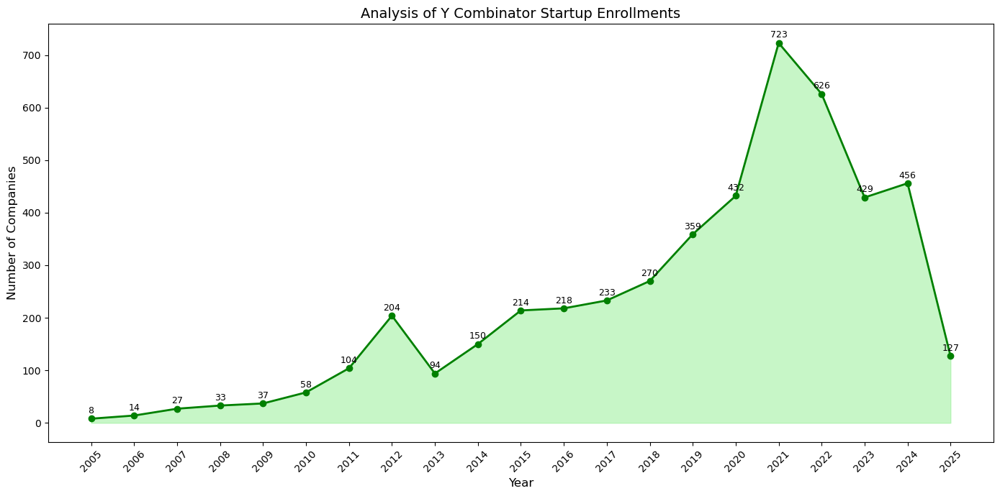
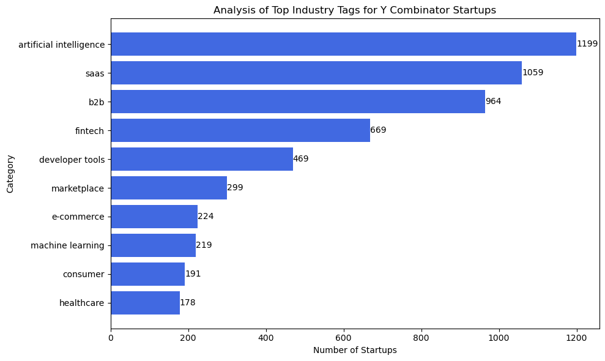
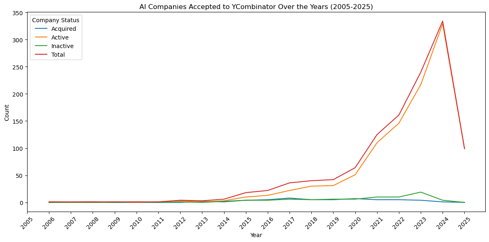
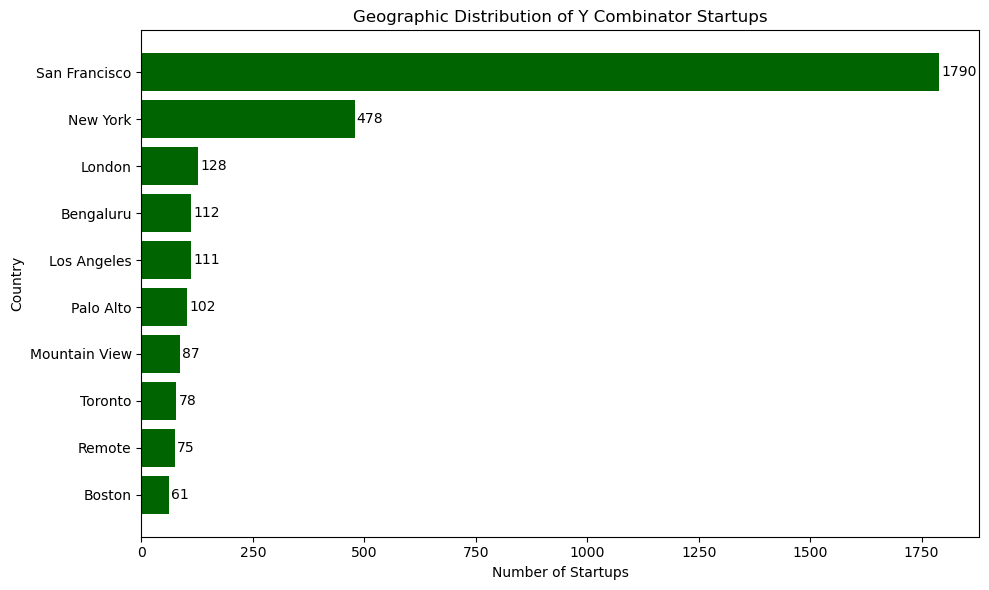
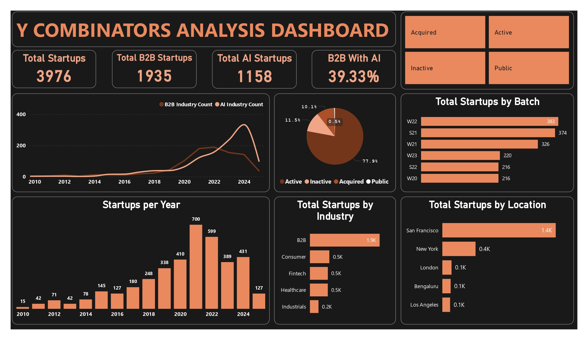
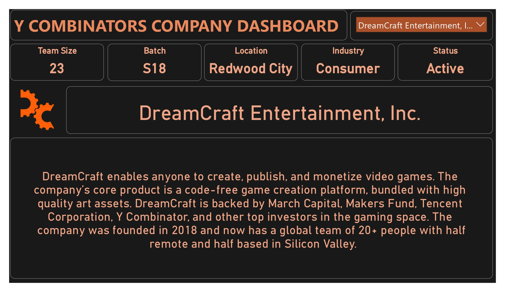

# Y Combinator Companies Analysis Dashboard

## 🧠 About Y Combinator
[Y Combinator (YC)](https://www.ycombinator.com/) is one of the world’s leading startup accelerators.  
It has funded over 4,000 startups including companies like Airbnb, Stripe, Dropbox, and Reddit.  
YC provides seed funding, mentorship, and connections to help startups scale and succeed.

---

## 📊 Project Overview
This project analyzes startups funded by Y Combinator using Python for data preprocessing and Power BI for dashboard visualization.

- **Python Preprocessing:** `YC Companies FEB2025.ipynb`
- **Visualization Report:** `PDF Report.pdf`

## 🔧 Tools & Technologies
- Python (Pandas, NumPy, Matplotlib, Seaborn)
- Power BI Desktop

## ⚙️ Steps Involved
1. **Data Cleaning:**  
   - Removed null and duplicate entries.
   - Standardized company information (Industry, Location, Status).

2. **Feature Engineering:**  
   - Created new features like B2B with AI indicator.
   - Merged and grouped startup data based on batch and year.

3. **Python Visualizations:**  
   - Plotted insights such as:
     - Geographic distribution of startups
     - AI startup growth over years
     - Top industry tags
     - Startup enrollments per year

4. **Exported Cleaned Data** for Power BI Dashboard development.

5. **Power BI Dashboard Includes:**
   - **Total Startups** (Overall, B2B, AI-based)
   - **Startups per Year** visualization
   - **Industry-wise & Location-wise breakdown**
   - **Company Status distribution** (Active, Acquired, Public, Inactive)
   - **Top Recent Batches** like W22, S21, W21, etc.
   - **Detailed Company Profiles** with batch, team size, industry, and funding information

## 📄 Files
| File | Description |
|:-----|:------------|
| `YC Companies FEB2025.ipynb` | Python script for data preprocessing and visualizations |
| `PDF Report.pdf` | Power BI dashboard snapshots and insights |

## 📊 Python Visualizations

### Yearly Startup Enrollments
Visualizes how the number of YC-backed startups changed year by year.
```python
enrollments = df['Year'].value_counts().sort_index()
plt.figure(figsize=(14,7))
plt.fill_between(enrollments.index, enrollments.values, color="lightgreen", alpha=0.5)
plt.plot(enrollments.index, enrollments.values, marker="o", color="green")
for i, v in enumerate(enrollments.values):
    plt.text(enrollments.index[i], v+10, str(v), ha='center', fontweight='bold')
plt.title('Analysis of Y Combinator Startup Enrollments')
plt.xlabel('Year')
plt.ylabel('Number of Companies')
plt.grid()
plt.show()
```


### Analysis of Top Industry Tags for Y Combinator Startups
Visualizes the top industry tags for Y Combinator startups.
```python
all_tags = [tag for tags in df['tags'] for tag in tags]
tag_counts = Counter(all_tags)

top_tags = tag_counts.most_common(10)
categories, counts = zip(*top_tags)

plt.figure(figsize=(10,6))
plt.barh(categories, counts, color='royalblue')
plt.xlabel('Number of Startups')
plt.ylabel('Category')
plt.title('Analysis of Top Industry Tags for Y Combinator Startups')
plt.gca().invert_yaxis()
for index, value in enumerate(counts):
    plt.text(value, index, str(value), va='center')
plt.grid(False)
plt.tight_layout()
plt.show()
```


### AI Companies Accepted to YCombinator Over the Years (2005-2025)
Displays the growth and trend of AI-focused companies being accepted into Y Combinator from 2005 to 2025, highlighting how the sector has evolved over the years.
```python
ai_df = df[df['tags'].apply(lambda tags: 'artificial intelligence' in tags)]

grouped = ai_df.groupby(['batch_year', 'status']).size().unstack(fill_value=0)

grouped['Total'] = grouped.sum(axis=1)

grouped = grouped.sort_index()

plt.figure(figsize=(12, 6))
for column in grouped.columns:
    plt.plot(grouped.index, grouped[column], label=column)

plt.title('AI Companies Accepted to YCombinator Over the Years (2005-2025)')
plt.xlabel('Year')
plt.ylabel('Count')
plt.xticks(ticks=years, labels=years, rotation=45)
plt.legend(title='Company Status')
plt.tight_layout()
plt.show()
```


### Geographic Distribution of Y Combinator Startups
Illustrates the geographic distribution of Y Combinator startups, showing the top locations where these companies are founded and the global spread of innovation.
```python

all_locations = df['all_locations'].dropna().apply(lambda x: x.replace('\n', ' ').split(',')[0].strip())

location_counts = Counter(all_locations).most_common(10)
countries, counts = zip(*location_counts)

plt.figure(figsize=(10, 6))
bars = plt.barh(countries[::-1], counts[::-1], color='darkgreen')

for bar in bars:
    width = bar.get_width()
    plt.text(width + 5, bar.get_y() + bar.get_height()/2, str(width), va='center')

plt.xlabel("Number of Startups")
plt.ylabel("Country")
plt.title("Geographic Distribution of Y Combinator Startups")
plt.tight_layout()
plt.show()
```


## 📊 Dashboard Overview

The **Analysis Dashboard** highlights key statistics and trends among Y Combinator startups, including:

- **Total Startups:** 3976
- **Total B2B Startups:** 1935
- **Total AI Startups:** 1158
- **B2B Startups with AI:** 39.33%

---

## 📈 Key Insights

- **Startups per Year**: 
  - Significant growth from 2010 to 2021, with a peak in 2020 (700 startups).
- **Startups by Batch**:
  - Top batches: W22 (383 startups), S21 (374 startups), W21 (326 startups).
- **Startups by Location**:
  - Major hubs: San Francisco (1.4K startups), New York (0.4K), London, Bengaluru, Los Angeles.
- **Startups by Industry**:
  - Leading industry: B2B (1.9K startups), followed by Consumer, Fintech, and Healthcare.
- **Startup Status Distribution**:
  - Active: 77.9%
  - Inactive: 11.5%
  - Acquired: 10.1%
  - Public: 0.5%

---

---
